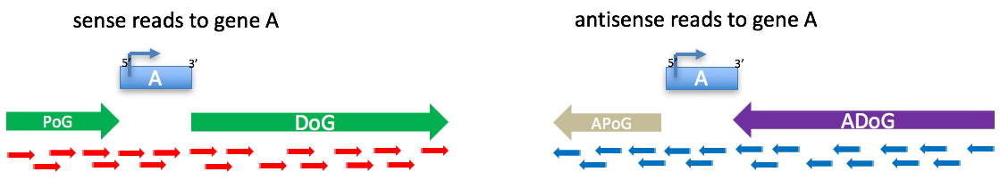

# Dogcatcher
Dogcatcher Algorithm

Dogcatcher will provide a gtf, bedfile, and csv of read-through transcription. 
In addition, it will provide a csv output of which genes and biotypes overlap read-through sections until the next gene (local) 
and past the next gene (meta) for the same and opposite strands, read-through length, intergenic length to the next gene,
 and if a gene has read-through from an upstream gene or goes a downstream gene. 
 Finally, it can obtain differential expression of read-through sections by acting as a wrapper
 for Rsubread and DESeq2.

Example of four different read-through regions found by Dogcatcher

        The Algorithm will find... 
        Downstream of Gene Transcripts (DoGs) - Sense reads past the end of gene 5' to 3'
        Antisense Downstream of Gene Transcripts (ADoGs) - Antisense reads past the end of gene 5' to 3'
        Previous of Gene Transcripts (PoGs) - Sense reads before the gene 3' to 5'
        Antisense Previous of Gene Transcripts (APoGs) - Antisense reads past the end of gene 3' to 5'
        
        How the algorithm works...
		The algorithm finds read-through sections using a sliding window with a percent coverage threshold.
		The size of the window and percent coverage is input by the user. (default is 100bp window and 90% coverage i.e. if 90bp of your 100bp window is covered)
		The window stops if coverage of reads drop below the threshold or at the start of the next gene on the same strand (for local read-through)
		It will then find any genes on the same and opposite strand that overlap with read-through and seperate them by biotypes.

Dogcatcher works in three parts.
1. Flatten the gtf.
 Script 1 will process the gtf from ensembl (Remove genes inside of other genes, keeping track of inside genes and any overlap on either strand)

2. Get DoGs, ADoGs, PoGs, and APoGs and filter longest or shortest from all samples.
Scripts 2-2.5 Create gtf's, csv's, and bedfiles of read-through

3. Differential expression (Optional).
	Scripts 3-5 will get counts and differential expression using an Rsubread-DESeq2 template to obtain non-significant genes 
	that will be combined with read-through gtf for proper normalization when calculating differential expression in DESeq2.

Input:

	Dogcatcher uses a gtf/annotation file and a folder of BedGraph files for input.

	gtf/annotation file:
		Dogcatcher has been tested on worm, human, and rat data.
		gtf's must be in the ensembl format
		You can download the worm gtf at ftp://ftp.wormbase.org/pub/wormbase/releases/
		You can download the gtf from ensembl at http://www.ensembl.org/info/data/ftp/index.html

	BedGraph files:
		BedGraph files are created from aligned bams using bedtools.
		The naming convention using plu.Bedgraph and min.BedGraph must be followed for Dogcatcher to work correctly
		Place all of the plu and min BedGraph files into a single folder for the input command

		This is the command used to create the files using bedtools version 2-2.26.0
		bedtools genomecov -bg -split -strand + -ibam file1.bam -g chromsizes.genome > file1_plu.BedGraph
		bedtools genomecov -bg -split -strand - -ibam file1.bam -g chromsizes.genome > file1_min.BedGraph

		For more information on using and installing bedtools go to
		http://bedtools.readthedocs.io/en/latest/index.html

Running Dogcatcher

Running_Dogcatcher.sh is provided to run all of the python scripts.
Here is a more in-depth explanation of each command

	Input commands:

	Path to your gtf file
	GTF=/gtf/Homo_sapiens.GRCh38.90.gtf

	Paths to folders containing your .bam files and .bedgraph files
	BAMPATH=BAMS_FOLDER
	BEDPATH=BEDS_FOLDER

	Amount of cpu's to use
	CPUS=4

	The level of significance for all programs
	(Change these individually for each script if you want different cutoffs)
	PADJ=0.05

	Output folders
	IN=/Dogcatcher_output
	COMPARISON_PATH=${IN}/Treatment_vs_Control

	Make output folders if they don't exists already
    mkdir -p ${IN}
    mkdir -p ${COMPARISON_PATH}

Flatten the gtf

	python 1.0_Dogcatcher_flatten_gtf.py --annotation_file_with_path ${GTF}

	This script will take out chromosome patches and all of the genes that are inside of other genes or upstream genes that overlap with genes on the same strand.
	It will write out a new gtf for the plus and minus strands of genes only.

Get Read-through sections

	2.0_Dogcatcher.py
	This is the main script for the program.
	This script processes each chromosome in parallel so cpu's can only go up to the number of chromosomes in your organism at this step.

    ###############= For Single File ###################
    python 2.0_Dogcatcher.py \
    --cpus $CPUS \
    --BedGraph_input_min_strand ${BEDPATH}/Treatment_1_min.BedGraph \
    --BedGraph_input_plu_strand ${BEDPATH}/Treatment_1_plu.BedGraph \
    --output_prefix  ${IN}/ \
    --annotation_file_with_path ${GTF} \
    --window_size 100 \
    --coverage_percentage 90

    ############### If running multiple files a handy bash loop has been provided
    ###############Loop through POS and MIN Files ###################
    declare -a MIN=($(ls -d ${BEDPATH}/*min.BedGraph | sort))
    declare -a POS=($(ls -d ${BEDPATH}/*plu.BedGraph | sort))
    L=${#MIN[@]}
    X=0
    while [  $X -le $L ]; do
        echo "**********"
        echo ${MIN[X]}
        echo ${POS[X]}
        python 2.0_Dogcatcher.py \
        --cpus $CPUS \
        --BedGraph_input_min_strand ${MIN[X]} \
        --BedGraph_input_plu_strand ${POS[X]} \
        --output_prefix  ${IN}/ \
        --annotation_file_with_path ${GTF} \
        --window_size 100 \
        --coverage_percentage 90
        let X=X+1
    done

    About each command...
	--window_size
			This is the sliding window size. Default set to 100

	--coverage_percentage
			This is the coverage percent calculated at each window. Default 0.95

	--BedGraph_input_path
			Example: BedGraph_input_files/
			This script will take the plu and min BedGraph files as input and create BedGraph files for each chromosome in a temporary folder.
			You can delete this file when you are finished calculating data. If you run multiple sessions it will find the temporary folder so you do not have to
			remake the BedGraphs for each chromosome every time.

    --get_biotypes
            Default True. Set to False if you dont care about biotype overlap. Although I would leave it on if doing DE
	--output_prefix
			This is the name of the output file
			Example: Dogcatcher_output/
	--cpus
			This is the amount of cores the program will use.

Get the longest contig of each sample

    This will filter the longest or shortest DoGs, ADoGs, PoGs, and APoGs 
    
    python 2.5_Dogcatcher_filter.py \
    --filter longest \
    --input_prefix ${IN}/ \
    --Dogcatcher_plu_strand_list \
    Treatment_1_plu.BedGraph \
    Treatment_2_plu.BedGraph \
    Treatment_3_plu.BedGraph \
    Control_1_plu.BedGraph \
    Control_2_plu.BedGraph \
    Control_3_plu.BedGraph \
    --Dogcatcher_min_strand_list \
    Treatment_1_min.BedGraph \
    Treatment_2_min.BedGraph \
    Treatment_3_min.BedGraph \
    Control_1_min.BedGraph \
    Control_2_min.BedGraph \
    Control_3_min.BedGraph \
    --output_prefix ${COMPARISON_PATH}/

Differential Expression

    This first script will create an Rsubread and DESeq2 R file from the template R_subread_DEseq2_TEMPLATE.R.
    Feel free to modify it to do different types of analysis depending on the experiment.

    The only thing in this section you have to fill in are the .bam files below. Replace your samples with the treatment or control samples.

    python 3.0_Create_R_subread_DESeq2_script.py \
    --annotation_file_with_path ${GTF} \
    --control_BAM_list \
    ${BAMPATH}/Control_1.bam \
    ${BAMPATH}/Control_2.bam \
    ${BAMPATH}/Control_3.bam \
    --treatment_BAM_list \
    ${BAMPATH}/Treatment_1.bam \
    ${BAMPATH}/Treatment_2.bam \
    ${BAMPATH}/Treatment_3.bam \
    --input_R_template_file R_subread_DEseq2_TEMPLATE.R \
    --input_prefix ${OUT} \
    --output_prefix ${OUT}/initial_Rsubread_DESeq2 \
    --cpus ${CPUS} \
    --padj ${PADJ}

    Run the created R script
    R CMD BATCH ${OUT}/initial_Rsubread_DESeq2/Rsubread_DESeq2_initial.R ${OUT}/initial_Rsubread_DESeq2/Rsubread_DESeq2_initial.R.out

    Now generate a gtf with read-through and non-significant genes for proper normalization

    python 4.0_Dogcatcher_Rsubread_DESeq2.py \
    --annotation_file_with_path ${GTF} \
    --input_prefix ${COMPARISON_PATH} \
    --input_prefix_DESeq2 ${OUT}/initial_Rsubread_DESeq2 \
    --output_prefix ${COMPARISON_PATH}/Dogcatcher_with_non-significant_genes \
    --padj ${PADJ}

    Run the R scripts from runon/runin gtf's with non-significant genes
    R CMD BATCH ${COMPARISON_PATH}/Dogcatcher_with_non-significant_genes/plu_ALL_SAMPLES_DOG_with_nonsig.R ${COMPARISON_PATH}/Dogcatcher_with_non-significant_genes/plu_ALL_SAMPLES_DOG_with_nonsig.R.out
    R CMD BATCH ${COMPARISON_PATH}/Dogcatcher_with_non-significant_genes/min_ALL_SAMPLES_DOG_with_nonsig.R ${COMPARISON_PATH}/Dogcatcher_with_non-significant_genes/min_ALL_SAMPLES_DOG_with_nonsig.R.out
    R CMD BATCH ${COMPARISON_PATH}/Dogcatcher_with_non-significant_genes/plu_ALL_SAMPLES_ADOG_with_nonsig.R ${COMPARISON_PATH}/Dogcatcher_with_non-significant_genes/plu_ALL_SAMPLES_ADOG_with_nonsig.R.out
    R CMD BATCH ${COMPARISON_PATH}/Dogcatcher_with_non-significant_genes/min_ALL_SAMPLES_ADOG_with_nonsig.R ${COMPARISON_PATH}/Dogcatcher_with_non-significant_genes/min_ALL_SAMPLES_ADOG_with_nonsig.R.out

    
    Lastly, it will filter out significant read-through from DESeq2 and match with the csv so you can get RSubread counts, DESeq2 fold changes, and biotypes. 
    I have also provided files without the biotypes as the dataframe can be quite large depending on the organism

    python 5.0_filter_sig_DESeq2.py \
    --annotation_file_with_path ${GTF} \
    --input_prefix ${COMPARISON_PATH} \
    --output_prefix ${COMPARISON_PATH}/FINAL_OUT \
    --input_runon_DESeq2_plu_sense_file ${COMPARISON_PATH}/Dogcatcher_with_non-significant_genes/plu_sense_ALL_SAMPLES_LONGEST_RUN_ON_with_nonsig_Dogcatcher_DESeq2_senseunique.csv \
    --input_runon_DESeq2_min_sense_file ${COMPARISON_PATH}/Dogcatcher_with_non-significant_genes/min_sense_ALL_SAMPLES_LONGEST_RUN_ON_with_nonsig_Dogcatcher_DESeq2_senseunique.csv \
    --input_runin_DESeq2_plu_antisense_file ${COMPARISON_PATH}/Dogcatcher_with_non-significant_genes/plu_antisense_ALL_SAMPLES_LONGEST_RUN_IN_with_nonsig_Dogcatcher_DESeq2_antisenseunique.csv \
    --input_runin_DESeq2_min_antisense_file ${COMPARISON_PATH}/Dogcatcher_with_non-significant_genes/min_antisense_ALL_SAMPLES_LONGEST_RUN_IN_with_nonsig_Dogcatcher_DESeq2_antisenseunique.csv \
    --padj ${PADJ}
    wait

Output files

    All bed files can be imported into the Integrative Genome Viewer (IGV) for manual inspection
    All gtf files can be used with Rsubread or DESeq2 for counts
    All csv files will contain all of the information found using Dogcatcher up to that point (i.e. no differential expression unless you have done those steps).

    
Output folder structure

    DOG_contigs and ADOG_contigs folders have all of read-through found in every sample put in the same folder
        DoGs and PoGs are found in the DOG_contigs folder
        ADoGs and APoGs are found in the ADOG_contigs folder
        csv will tell you read-through start and end for local and meta regions, length, and if there is read-through downstream or upstream of the gene.
    
    initial_Rsubread_DESeq2 folder has all of the gene counts and differential expression for gene counts to find non-significant genes
     
    Dogcatcher_with_non-significant_genes folder has gtf's of longest or shortest read-through regions combined with non-significant genes as well as outputs of Rsubread and DESeq2
    
    FINAL_OUT folder has All (everything) or Significant (only read-through that passed the padj cutoff) folders with beds, biotypes, and combined output csv (both strands and DoGs with PoGs and ADoGs with APoGs).
        The biotypes csv files have...
            biotypes.csv - wide format with each row a read-through regions and columns of each biotype with a list of genes overlapped in each cell
            biotypes_UNPACKED.csv - long format with one row per overlapped gene as well as if it is overlapped on the same or opposite strand.
